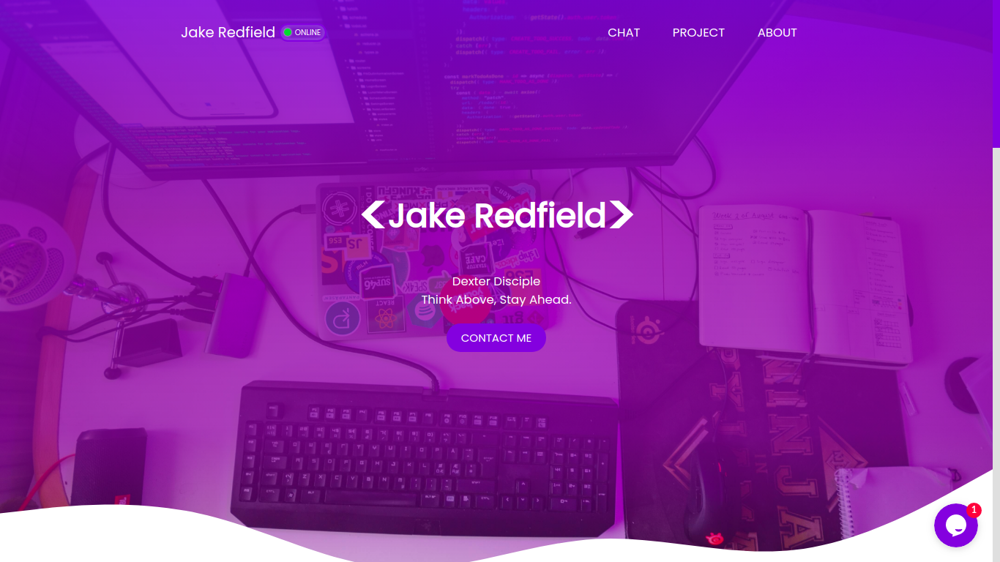

# About
https://thisisvivek.me is version 2.0 with few updates and customization.

## Technology

* HTML
* CSS
* Javascript
* Bootstrap
* Jquery
* Exteral Library

Screenshots
----



## Usage
Preferably, you can download this site by cloning the Git repository:
```
git clone https://github.com/heythisisvivek/heythisisvivek.github.io
```

Links
----

* Homepage: https://thisisvivek.me
* Twitter: [@heythisisvivek](https://twitter.com/heythisisvivek)
* Telegram: [@heythisisvivek](https://t.me/heythisisvivek)

## Contributing
Pull requests are welcome. For major changes, please open an issue first to discuss what you would like to change.

Please make sure to update tests as appropriate.